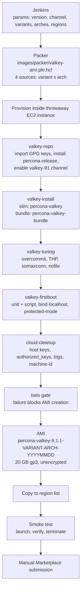
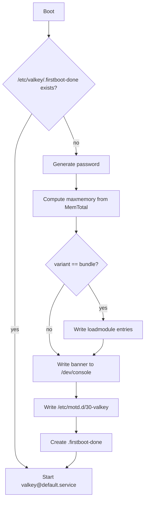

# Percona Valkey AMI — Design

**Date:** 2026-08-08
**Status:** Approved, pending implementation
**Scope:** AWS AMI images for Percona Valkey, published to AWS Marketplace

## Goal

Produce and publish AWS Marketplace AMIs for Percona Valkey 9.1.1 on Amazon Linux 2023,
in two content variants and two CPU architectures, built by a repeatable pipeline with
automated bake-time and boot-time verification.

## Non-goals

- Non-AWS image formats (OVF, Azure, GCP). Roles are kept cloud-agnostic so these can be
  added later as new builder blocks, but no non-AWS output is produced now.
- Paid or metered Marketplace listings. The listing is free; no product code, entitlement
  check, or metering call is embedded in the image.
- Changes to the DEB/RPM packaging itself. The image consumes published packages as-is.
- Automated Marketplace submission. Submission is a manual step for this milestone.

## Decisions

| Area | Decision |
|---|---|
| Distribution | AWS Marketplace listing, free (no charge, open source) |
| Base OS | Amazon Linux 2023 |
| Architectures | x86_64 and arm64 |
| Variants | `slim` and `bundle` (4 images total) |
| Package source | Percona repository, `valkey-91` component, `release` channel |
| Valkey version | 9.1.1 |
| Location | `images/` directory in this repository |
| Build tool | Packer HCL2 with Ansible roles via `ansible-local` |
| CI | Jenkins |
| Storage | Single 20 GB gp3 root volume, unencrypted, data on root |
| First-boot auth | Generated per-instance password, surfaced via console and MOTD |
| Module loading | `bundle` auto-loads all modules; `slim` ships none |
| OS tuning | Baked into the image; `maxmemory` computed at first boot |
| Host firewall | None; security groups are the boundary |
| Build network | Dedicated build VPC, IDs committed to the repository |
| Testing | In-image bats gate plus post-launch smoke test |
| Milestone | 4 AMIs built, tested, and copied to the region list |

### Rationale for selected trade-offs

**Packer with Ansible rather than shell provisioners.** Configuration logic stays in
discrete, idempotent roles rather than accumulating in scripts. A future Azure or OVF
target becomes a new source block instead of a rewrite.

**EC2 Image Builder rejected.** Its component format is AWS-proprietary, which conflicts
with keeping the provisioning logic portable, and it does not fit the Jenkins-driven
release process.

**systemd ordering rather than cloud-init `per-once`.** The first-boot unit is ordered
`Before=valkey@default.service`, so Valkey never starts in an unconfigured state and no restart
is required after configuration is written. The mechanism carries unchanged to platforms
without cloud-init.

**Unencrypted root volume.** AWS Marketplace does not accept encrypted AMIs. Users enable
encryption at launch time.

**`maxmemory-policy noeviction`.** `maxmemory` is capped so a large dataset cannot drive
the instance into the OOM killer, but the eviction policy stays at the Valkey default.
Silently discarding keys would be the wrong default for users treating Valkey as a
datastore; write commands failing with a clear error is recoverable and visible.

## Package mapping

On RPM-based systems the server, sentinel, and CLI tools ship in a single package. The
`-server` / `-sentinel` / `-tools` split exists only on DEB.

| Variant | Packages installed | Contents |
|---|---|---|
| `slim` | `percona-valkey` | valkey-server, valkey-sentinel, valkey-cli, valkey-benchmark, valkey-check-aof, valkey-check-rdb |
| `bundle` | `percona-valkey-bundle` | The above plus `percona-valkey-json`, `percona-valkey-bloom`, `percona-valkey-search`, `percona-valkey-ldap` |

Module objects install to `%{_libdir}/valkey/modules`, which resolves to
`/usr/lib64/valkey/modules` on both supported architectures.

## Architecture



### First-boot sequence

`valkey-firstboot.service` is ordered `Before=valkey@default.service`, `WantedBy=multi-user.target`,
and guarded by `ConditionPathExists=!/etc/valkey/.firstboot-done`.



The script writes `/etc/valkey/valkey-generated.conf`, owned `root:valkey`, mode `0640`,
included from `/etc/valkey/default.conf` as its final directive. It contains:

| Directive | Value |
|---|---|
| `requirepass` | 32 alphanumeric characters drawn from `/dev/urandom`, avoiding characters that would need quoting in the configuration file |
| `maxmemory` | 70% of `MemTotal` |
| `maxmemory-policy` | `noeviction` |
| `loadmodule` | One line per module object, `bundle` variant only |

Module lines are produced by enumerating `*.so` under `/usr/lib64/valkey/modules`, matching
the discovery approach already used by the bundle container entrypoint, so a module added to
the bundle package is picked up without a code change.

The banner is written to `/dev/console` so it appears in the EC2 system log and is
retrievable without SSH access, and to `/etc/motd.d/30-valkey` so it appears on login.

Rerunning the script is a no-op once the marker exists. This is verified by the smoke test,
because a password regenerated on every reboot is the primary failure mode of this design.

## Repository layout

```
images/
  README.md
  Makefile
  packer/
    valkey-ami.pkr.hcl
    variables.pkr.hcl
    build-vpc.auto.pkvars.hcl
    release.pkvars.hcl
  ansible/
    valkey-ami.yml
    roles/
      valkey-repo/
      valkey-install/
      valkey-tuning/
        files/
          99-valkey.conf
          valkey-thp.service
          10-limits.conf
      valkey-firstboot/
        files/
          valkey-firstboot.sh
          valkey-firstboot.service
      cloud-cleanup/
  test/
    bats/
      install.bats
      config.bats
      hardening.bats
    smoke/
      smoke.sh
  jenkins/
    Jenkinsfile
```

## Components

| Unit | Responsibility | Depends on |
|---|---|---|
| `packer/valkey-ami.pkr.hcl` | Source matrix, AMI naming, tags, region copy | AWS, variables |
| `packer/variables.pkr.hcl` | Variable declarations and validation | — |
| `packer/build-vpc.auto.pkvars.hcl` | Build VPC, subnet, and security group IDs | Build account |
| `packer/release.pkvars.hcl` | Version, channel, region list | — |
| `ansible/roles/valkey-repo` | GPG key import, `percona-release` install, channel enable | Network |
| `ansible/roles/valkey-install` | Variant to package set | `valkey-repo` |
| `ansible/roles/valkey-tuning` | sysctl, THP, ulimits | — |
| `ansible/roles/valkey-firstboot` | First-boot unit and script, locked baseline config | `valkey-install` |
| `ansible/roles/cloud-cleanup` | Remove identity, secrets, logs before bake | Runs last |
| `test/bats/*.bats` | Bake-time correctness gate | — |
| `test/smoke/smoke.sh` | Boot-time behaviour gate | Published AMI |
| `jenkins/Jenkinsfile` | Matrix, credentials, region copy, smoke stage | All |

Each role has a single responsibility and can be exercised independently. No role depends on
AWS metadata services. The console write is the only AWS-adjacent behaviour and degrades
harmlessly on platforms without a console device.

## Repository configuration

The `valkey-repo` role reproduces the verification sequence already used by the container
images: import the Percona packaging key and the base distribution key, download
`percona-release-latest.noarch.rpm`, verify its signature with `rpmkeys --checksig` before
installing it, then `percona-release disable all` followed by
`percona-release enable valkey-91 <channel>`.

The resolved package version is echoed during provisioning and asserted by the bats suite,
so a channel that has not yet been promoted fails the build with a clear message rather than
silently producing an image at the wrong version.

## Baseline configuration baked into the image

The packaging is multi-instance. The unit is a template, `valkey@.service`, and the
canonical instance is `valkey@default`, which reads `/etc/valkey/default.conf`. That file
includes `/etc/valkey/includes/valkey.defaults.conf` and then overrides it. There is no
`valkey.service` and no `/etc/valkey/valkey.conf`.

| Setting | Value | Reason |
|---|---|---|
| `bind` | `127.0.0.1 -::1` in `default.conf` | Nothing reachable until the user opts in |
| `protected-mode` | `yes` in `default.conf` | Defence in depth alongside `bind` |
| `valkey@default.service` | Enabled | Service starts on boot, after first-boot configuration |
| `valkey-sentinel@default` | Installed, not enabled | Available for HA users without adding packages |
| `vm.overcommit_memory` | `1` | Required for reliable background saves |
| Transparent huge pages | Disabled via unit | Removes latency spikes and the startup warning |
| `net.core.somaxconn` | `1024` | Raises the packaged default of 512 |
| `LimitNOFILE` | `65535` | Raises the unit default of 10240 |

The package already ships `/etc/sysctl.d/00-valkey.conf` setting `vm.overcommit_memory=1`
and `net.core.somaxconn=512`. The image adds `99-valkey.conf`, which sorts later and wins.

## Security and Marketplace requirements

The image must satisfy all of the following, each covered by a bats assertion:

- No password set for any OS account, and root login over SSH disabled
- No `authorized_keys` present for any account
- No SSH host keys in the image; regenerated on first boot
- No build artifacts, package caches, or provisioning logs left behind
- `machine-id` cleared, shell history removed, cloud-init state reset
- No credentials or keys in the image filesystem
- Root volume unencrypted, as required for Marketplace AMI listings
- Valkey not reachable from outside the instance in the default configuration

## Testing

### In-image bats

Runs inside the build instance before the snapshot. Failure blocks AMI creation.

**install.bats**
- Expected package set installed for the variant
- Installed Valkey version matches the requested version
- `valkey` user and group exist
- `valkey@default.service` present and enabled; sentinel instance present and not enabled
- `bundle` only: all four module objects present in the module directory

**config.bats**
- `bind` is loopback only and `protected-mode` is `yes`
- `valkey-generated.conf` is included by `default.conf`
- First-boot unit installed and enabled, and the completion marker is absent
- Tuning files present with expected values

**hardening.bats**
- No `authorized_keys` for any account
- `PermitRootLogin no`
- No SSH host keys present
- No OS account has a usable password
- No package cache, build artifacts, or provisioning logs remain

### Post-launch smoke

Runs against a launched instance of the finished AMI. Failure marks the build failed and
leaves the AMI unpublished.

- Instance reaches running state and the console log contains the credential banner
- `valkey-cli -a <password> PING` returns `PONG`
- `maxmemory` is non-zero and approximately 70% of instance memory
- `bundle` only: `MODULE LIST` reports json, bloom, search, and ldap
- Port 6379 is not reachable from outside the instance
- After a reboot, the password is unchanged and the service is running

## Failure handling

| Failure | Behaviour |
|---|---|
| Provisioning error | Packer fails, instance terminated, no AMI, build red |
| bats failure | Hard gate before snapshot; no AMI created |
| Smoke failure | AMI exists but is not published; build marked failed |
| Region copy interruption | Copy is idempotent and safely re-runnable |
| Package or channel unavailable | Fails fast in `valkey-repo` with the resolved version reported |

## Naming and versioning

AMI name: `percona-valkey-<valkey_version>-<variant>-<arch>-<YYYYMMDD>`

Example: `percona-valkey-9.1.1-bundle-arm64-20260808`

Variant, architecture, Valkey version, channel, and build identifier are also applied as AMI
tags so images can be filtered without parsing names.

## Build network configuration

Build VPC, subnet, and security group IDs are committed in a single file,
`packer/build-vpc.auto.pkvars.hcl`, and can be overridden with `-var-file` for builds in
another account. Confining them to one file keeps a future infrastructure change to a
single edit.

## Milestones

| ID | Deliverable |
|---|---|
| M0 | `images/` scaffolding: directory tree, variables, role skeletons, Makefile |
| M1 | `slim` x86_64 end to end, built locally: bake, bats, launch, smoke |
| M2 | `bundle` variant and arm64 added; all four images built; region copy |
| M3 | Jenkinsfile with build matrix, credentials, region copy, and smoke stage |
| M4 | Marketplace preparation: scan checklist, usage instructions, listing content |

M1 deliberately precedes M2. Proving the full path on one image avoids debugging four
images simultaneously.

## Assumptions

- Percona Valkey 9.1.1 packages are available in the `release` channel of the `valkey-91`
  repository component for both x86_64 and aarch64 at build time. If promotion has not
  happened, the channel variable allows building against `testing` in the interim.
- A build VPC with outbound internet access exists in the build account, and Jenkins has
  credentials permitting EC2 instance launch, AMI creation, and cross-region copy.
- A Percona AWS Marketplace seller account exists for the manual submission step in M4.
